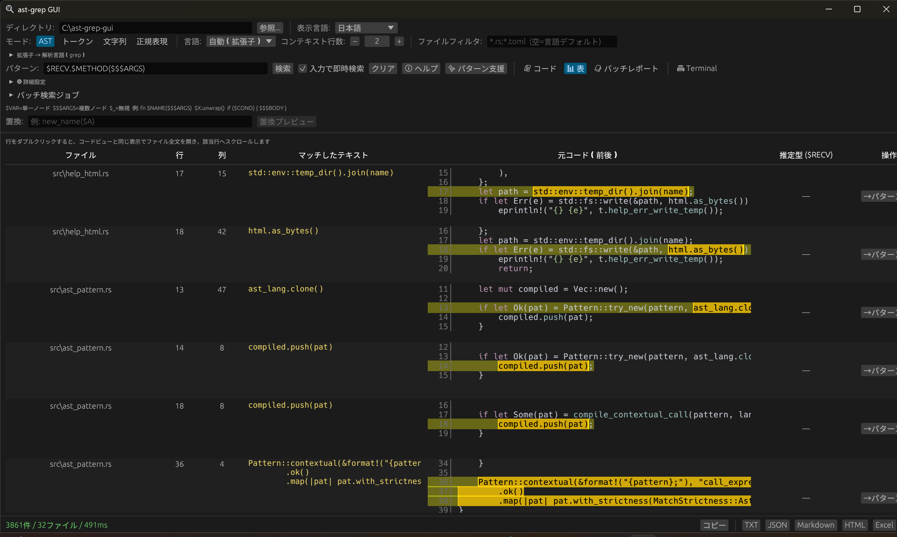

# ast-grep GUI

[English README](./README.md)

Rust と `egui` で作られた [ast-grep](https://ast-grep.github.io/) 向けのデスクトップ GUI フロントエンドです。
CLI に慣れていないユーザーでも、構造検索を視覚的に使いやすくすることを目的にしています。



## 主な機能

- `ast-grep-core` を使った AST ベースの構造検索
- `AST` モードで `--rewrite` 相当の一括置換（プレビュー・差分確認・ファイルへ書き戻し）
- `AST`、`Token`、文字列検索、正規表現検索の 4 モード
- 拡張子ベースの自動言語判定で混在リポジトリにも対応
- コードビュー・表ビュー（ダブルクリックでプレビューポップアップ）・**バッチレポート**の結果表示（バッチは複数パターンを個別条件で一括実行し集約）
- 対応言語では検索結果に `$RECV` の推定型ヒントを表示
- パターンヘルプ、プリセット、スニペットからのパターン支援、**パターン入力履歴**（最大 30 件）
- 入力停止後に自動再検索できる **インクリメンタル検索**
- 正規表現をトークン単位で解析・テストできる**正規表現ビジュアライザ**
- 文字列検索向けの **大文字小文字無視** / **単語単位一致** オプション
- `TXT`、`JSON`、`Markdown`、`HTML`、`Excel (.xlsx)` へのエクスポート（単一検索結果に加え、バッチ完了後は **複数ジョブ分をまとめた** レポート出力）
- 日本語 / 英語の UI 切り替え（OS ロケールから自動判定）
- 収集ヒット上限の設定（デフォルト: 100,000 件、0 で無制限）
- `chardetng` による自動文字コード判定と、`UTF-8` / `UTF-16 LE` / `UTF-16 BE` / `Shift_JIS` / `EUC-JP` / `JIS` / `GBK` / `Big5` / `EUC-KR` / `Latin1` 系の手動指定
- PowerShell コマンドや `sg run` 風検索を使える内蔵ターミナル

## 対応言語

- Rust
- Java
- Python
- JavaScript
- TypeScript
- Go
- C
- C++
- C#
- Kotlin
- Scala
- `Auto` モードでは拡張子から言語を自動判定します

## 動作要件

- Rust stable toolchain
- 主なターゲット環境は Windows
- このリポジトリのリリースビルド対象は `x86_64-pc-windows-msvc`

## ローカル実行

```powershell
cargo run
```

最適化付きで実行する場合:

```powershell
cargo run --release
```

Windows 向けリリースバイナリを明示的にビルドする場合:

```powershell
cargo build --release --target x86_64-pc-windows-msvc
```

## 使い方

1. 検索対象ディレクトリを選びます。
2. 検索モードを選びます。
3. `AST` モードでは対象言語を選ぶか `Auto` を使います。
4. AST パターン、トークン列、文字列、または正規表現を入力します。
5. 必要に応じてコンテキスト行数、ファイルフィルタ、文字コード、スキップディレクトリ、各モード固有オプションを調整します。
6. 検索を実行し、コードビューまたは表ビューで結果を確認します。
7. 必要なら結果をコピーまたはエクスポートします。

### AST パターンのヒント

- `$VAR`、`$$$ARGS`、`$_` などのメタ変数を使えます
- パターンに `$RECV` を含めると、アプリがレシーバー型を推定して結果表示やエクスポートに反映します
- 内蔵ヘルプから例やプリセットを参照できます
- パターン支援ダイアログでコード片から候補パターンを生成できます

例:

```text
fn $NAME($$$ARGS)
$VAR.unwrap()
console.log($$$ARGS)
```

## 検索モード

- `AST`: ast-grep の構造検索
- `Token`: 空白区切りのトークンを順番通りに検索し、トークン間の空白差を吸収
- `文字列`: 通常の部分一致検索。必要に応じて大文字小文字無視 / 単語単位一致を指定可能
- `正規表現`: 正規表現による検索

## エクスポート形式

- `TXT`
- `JSON`
- `Markdown`
- `HTML`
- `Excel (.xlsx)`
- クリップボードコピー

パターンに `$RECV` が含まれる場合は、`JSON`、`Markdown`、`HTML`、`Excel` の出力にも各マッチの推定型が含まれます。

## 配布とリリース

- `build.rs` は `assets/icon.ico` が存在すれば Windows ビルドに埋め込みます
- `.cargo/config.toml` では `x86_64-pc-windows-msvc` 向けに CRT 静的リンクを有効化しています
- `.github/workflows/release.yml` は `v*` タグ push 時に `ast-grep-gui.exe` をビルドして GitHub Release に添付します

## ディレクトリ概要

```text
src/main.rs              アプリ起動処理
src/app.rs               アプリ状態と UI 全体制御
src/search.rs            バックグラウンド検索エンジン
src/ast_pattern.rs       パターンコンパイル戦略（C/C++ コンテキスト補完など）
src/receiver_hint.rs     レシーバー型の best-effort 推定
src/lang.rs              言語定義とプリセット
src/pattern_assist.rs    スニペットからのパターン候補生成
src/export.rs            各種エクスポート処理
src/file_encoding.rs     文字コード検出・読み込み
src/i18n.rs              UI 表示言語（日本語 / 英語）
src/regex_visualizer.rs  正規表現ビジュアライザ用トークナイザ
src/help_html.rs         埋め込み HTML ヘルプを OS ブラウザで開く
src/terminal.rs          内蔵ターミナル状態管理
src/sg_command.rs        `sg run` 風コマンドのパース
src/ui/                  GUI パネルとポップアップ
assets/help/             埋め込みパターンヘルプ HTML
```

## 補足

- 現状は Windows 向け配布を主眼にしています。
- マッチ位置の列オフセットはバイト単位のため、マルチバイト文字ではハイライトにずれが出る場合があります。
- 検索設定やパターン履歴はアプリ再起動後も保持されます。
