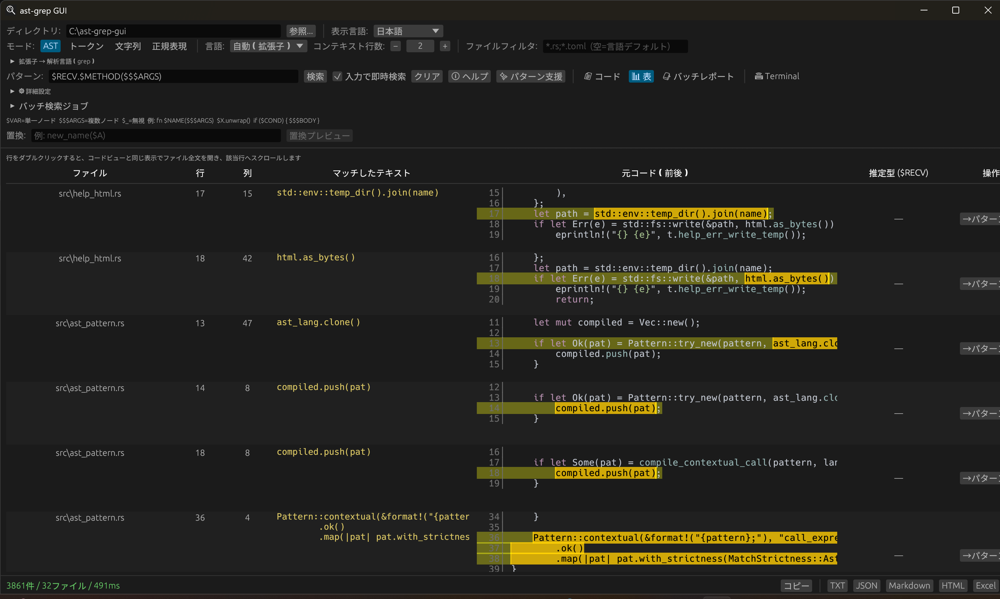

# ast-grep GUI

[English README](./README.md)

Rust と `egui` で作られた [ast-grep](https://ast-grep.github.io/) 向けのデスクトップ GUI フロントエンドです。
CLI に慣れていないユーザーでも、構造検索を視覚的に使いやすくすることを目的にしています。



## 主な機能

- **検索対象:** ローカルディレクトリ、または **Git / SVN のリモート URL**（事前の clone/checkout 不要。ローカルキャッシュへ取得してから検索）
- **関連付けで開く:** ファイル一覧・コードビュー・表ビューから、ヒットしたファイルを OS の既定アプリで開ける
- `ast-grep-core` を使った AST ベースの構造検索
- `AST` モードで `--rewrite` 相当の一括置換（プレビュー・差分確認・ファイルへ書き戻し）
- `AST`、`Token`、文字列検索、正規表現検索、**YAML Rule**（内蔵 ast-grep ルール検索・外部 `sg` CLI 不要）の 5 モード
- 拡張子ベースの自動言語判定で混在リポジトリにも対応
- コードビュー・表ビュー（ダブルクリックでプレビューポップアップ）・**サマリー**表示（型ヒントのバリエーションを受信側の型・引数数・各引数の型などで集計。パターンによってはメソッド列も表示）・**バッチレポート**（複数パターンを個別条件で一括実行し集約）
- **型ヒント（主に C/C++ 向け）:** メタ変数キャプチャに対する構文ベースの best-effort 推論。単一メタ変数（`$NAME`）は列ごとに、複数ノードキャプチャ（`$$$ARGS` など）は **`NAME#arity`**（キャプチャ個数）と **`NAME#0`**、**`NAME#1`** … の列。**C / C++ が主対象**（レガシー MFC/Win32 のモダナイゼーション支援を想定）。他言語は簡易推論のみ。**C++** はディスク上の `#include` を辿ってヘッダ内の宣言を参照できます。**詳細設定**（AST 系モード時）で **`;` 区切りのインクルードディレクトリ**（`-I` 相当）と **インクルード診断パネル** を利用できます。**型ヒント補助設定**（YML・**C++ 専用**）で、メソッド戻り型・マクロ・定数・フィールド・二項演算子などを明示的に登録できます。
- パターンヘルプ、プリセット、スニペットからのパターン支援、**パターン入力履歴**（最大 30 件）
- 入力停止後に自動再検索できる **インクリメンタル検索**
- 正規表現をトークン単位で解析・テストできる**正規表現ビジュアライザ**
- 文字列検索向けの **大文字小文字無視** / **単語単位一致** オプション
- `TXT`、`JSON`、`Markdown`、`HTML`、`Excel (.xlsx)` へのエクスポート（単一検索結果に加え、バッチ完了後は **複数ジョブ分をまとめた** レポート出力）
- 日本語 / 英語の UI 切り替え（OS ロケールから自動判定）
- 収集ヒット上限の設定（デフォルト: 100,000 件、0 で無制限）
- `chardetng` による自動文字コード判定と、`UTF-8` / `UTF-16 LE` / `UTF-16 BE` / `Shift_JIS` / `EUC-JP` / `JIS` / `GBK` / `Big5` / `EUC-KR` / `Latin1` 系の手動指定
- PowerShell コマンドや `sg run` 風検索を使える内蔵ターミナル
- コードビュー・**表ビュー**・ファイルプレビューでの **Ctrl+F ビュー内検索**（文字列のリテラル一致、大文字小文字の切り替え、↑↓で移動・スクロール追従、**一致箇所のハイライト**〈現在の一致を強調〉）
- **同一 exe の `--batch` モード** による大量パターン一括検索（1 行 1 パターンのファイルから実行）
- **GUI コマンドライン補助画面**（CLI コマンドの組み立て・コピー・GUI 内直接実行）

## 対応言語

- Rust
- Java
- Python
- JavaScript
- TypeScript
- Go
- C
- C++
- C#
- Kotlin
- Scala
- `Auto` モードでは拡張子から言語を自動判定します

## 動作要件

- Rust stable toolchain
- 主なターゲット環境は Windows
- このリポジトリのリリースビルド対象は `x86_64-pc-windows-msvc`

## ローカル実行

```powershell
cargo run
```

最適化付きで実行する場合:

```powershell
cargo run --release
```

Windows 向けリリースバイナリを明示的にビルドする場合:

```powershell
cargo build --release --target x86_64-pc-windows-msvc
```

CLI バッチモードは同一 exe から `--batch` で起動します（別バイナリは不要）。

## コマンドライン一括検索

GUI を開かずに、**1 行 1 パターン**のテキストファイルから大量の AST パターンを順次検索できます。

### パターンファイル例 (`patterns.txt`)

```text
# コメント行は無視されます
fn $NAME($$$ARGS)
$VAR.unwrap()
console.log($$$ARGS)
```

### 基本コマンド

```powershell
cargo run -- --batch `
  --patterns patterns.txt `
  --dir C:\path\to\repo `
  --lang rust `
  --view table `
  --format json `
  --output result.json
```

### 出力ビュー

| ビュー | 説明 |
|--------|------|
| `code` | コードビュー相当（ファイル単位・前後コンテキスト付き） |
| `table` | 表ビュー相当（型ヒント列を含むフルテーブル） |
| `summary` | サマリー（型ヒントのバリエーション集計） |

複数ビューは `--view code,summary` のように指定できます。Excel (`xlsx`) では **1 つのブック内にビュー別シート**が作られます。

```powershell
cargo run -- --batch `
  --patterns patterns.txt `
  --dir C:\path\to\repo `
  --lang cpp `
  --view code,summary `
  --format xlsx `
  --output report.xlsx
```

### 主なオプション

| オプション | 説明 |
|-----------|------|
| `--patterns` | 1 行 1 パターンの入力ファイル |
| `--dir` | 検索対象ルート（ローカル） |
| `--git-url` | 検索前に取得する Git リモート URL（`--dir` の代わり） |
| `--svn-url` | 検索前に取得する SVN リモート URL（`--dir` の代わり） |
| `--ref` | Git のブランチ / タグ / コミット（`--git-url` と併用） |
| `--revision` | SVN のリビジョン（`--svn-url` と併用。空 = HEAD） |
| `--subdir` | 取得したツリー内のサブディレクトリ |
| `--refresh-cache` | 次回実行時にリモートを再取得 |
| `--lang` | 言語（`auto` / `rust` / `cpp` など） |
| `--view` | `code` / `table` / `summary`（`,` 区切り可） |
| `--format` | `text` / `json` / `markdown` / `html` / `xlsx` |
| `--output` | 出力先（バッチモードでは必須） |
| `--context` | コンテキスト行数（既定: 2） |
| `--filter` | ファイル名フィルタ（`;` 区切り glob） |
| `--skip-dirs` | スキップディレクトリ名（`;` 区切り） |
| `--max-hits` | パターンごとのヒット上限（0 = 無制限） |
| `--include-dirs` | C++ 型ヒント用インクルードパス（`;` 区切り） |
| `--no-type-hints` | 型ヒント推定を無効化 |

### リモート Git / SVN（バッチ）

```powershell
cargo run -- --batch `
  --patterns patterns.txt `
  --git-url https://github.com/example/repo.git `
  --ref main `
  --subdir src `
  --lang rust `
  --view table `
  --format json `
  --output result.json
```

```powershell
cargo run -- --batch `
  --patterns patterns.txt `
  --svn-url https://svn.example.com/repo/trunk `
  --revision 12345 `
  --lang auto `
  --view table `
  --format json `
  --output result.json
```

リモート取得は Rust ライブラリ（Git: `gix`、SVN: `svn` + WebDAV）で行い、`git` / `svn` コマンドは使いません。取得結果は `%LOCALAPPDATA%\ast-grep-gui\vcs-cache`（Windows）にキャッシュされます。

## GUI のコマンドライン補助

ツールバーの **バッチジョブ** セクションにある **「⌨ CLI 補助」** から、上記 CLI と同等の条件を GUI で組み立てられます。

1. **パターンファイル**と**出力ファイル**（任意、`xlsx` 時は必須）を指定
2. **出力ビュー**（コード / 表 / サマリー）と**出力形式**を選択
3. **コマンドプレビュー**を確認し、**コピー**または**この設定で実行**
4. 実行時は GUI 内のバッチ検索として走り、**バッチレポート**画面で結果を確認
5. 出力ファイルを指定していた場合、完了後に自動エクスポート

検索ディレクトリ・言語・詳細設定などは、メイン画面のツールバー設定がそのまま使われます。検索対象が **Git URL** または **SVN URL** のときは、リモート URL・ref/revision・サブディレクトリも CLI プレビューに含まれます。

## 使い方

1. **検索対象**を選びます: **ローカル**、**Git URL**、**SVN URL**。
2. **ローカル**ならディレクトリを指定。**Git/SVN** ならリモート URL と、必要なら ref/revision・サブディレクトリを入力します。次回検索で再取得する場合は **再取得** を使います。
3. 検索モードを選びます（`AST` / `Token` / 文字列 / 正規表現 / **YAML Rule**）。
4. `AST` モードでは対象言語を選ぶか `Auto` を使います。**YAML Rule** モードではルールを設定します（下記参照）。
5. AST パターン、トークン列、文字列、正規表現、または YAML ルールを入力します。
6. 必要に応じてコンテキスト行数、ファイルフィルタ、文字コード、スキップディレクトリ、各モード固有オプション、（AST 系モードでは）**詳細設定**（**C++ インクルードパス**、**インクルード診断パネル** など）を調整します。
7. 検索を実行し、コードビュー・表ビュー・**サマリー**で結果を確認します。
8. ヒットの **開く** で OS の既定アプリにファイルを開く、または結果をコピー・エクスポートします。

### リモート Git / SVN 検索

- **Git URL** は HTTPS、SSH（`git@…`）、`git://`、`file://` に対応（`gix` 使用、`git` 実行ファイルは不要）。
- **SVN URL** は `svn://` と HTTP(S) に対応（Rust ライブラリ使用、`svn` 実行ファイルは不要）。
- 指定した ref/revision の **追跡対象ツリー** のみ検索します（未追跡ファイルは含みません）。
- 取得に成功すると、ツールバーに解決済みキャッシュパスが表示されます。
- **注意:** 現状の依存関係では `svn+ssh://` は未対応です（Rust ツールチェーン / crate 互換のため）。

### ビュー内検索（Ctrl+F）

コードパネル・表ビュー・ファイルプレビューをフォーカスした状態で **Ctrl+F** を押すと検索バーが開きます。検索語を入力し、必要なら **大文字小文字を区別** を切り替え、**↑ / ↓**（またはボタン）で一致へ移動します。ソース表示（コードビュー・プレビュー）では一致が**色付き**で示され、表ビューでは該当行へスクロールします。

### YAML Rule 検索

ツールバーで **YAML Rule** を選ぶと、外部 `sg` CLI なしで [ast-grep YAML ルール](https://ast-grep.github.io/)を実行できます（内蔵 `ast-grep-config` エンジンでロード）。

1. 必要なら **`sgconfig.yml`** のパスを指定（空なら検索ルートから上方向に自動検出）。
2. 必要なら **単一 rule YAML ファイル**を指定するか、ツールバーの **rule 本文**欄に直接入力（本文がファイル指定より優先）。
3. 必要なら **rule id** の正規表現フィルタ（空なら全 rule）。
4. 検索を実行。走査対象の拡張子は各 rule の `language` / `languageGlobs` から自動決定されます。

複数 rule は `---` で区切ります。入力例:

```yaml
id: find-unwrap
language: Rust
rule:
  pattern: $EXPR.unwrap()
```

### AST パターンのヒント

- `$VAR`、`$$$ARGS`、`$_` などのメタ変数を使えます
- コードをキャプチャするメタ変数を含むパターンでは、可能な範囲で型ヒントを計算します。**単一**メタ変数（`$RECV`、`$VAR` …）はメタ変数ごとに 1 列、**複数ノード**（`$$$ARGS` …）は **`NAME#arity`** 列（キャプチャされたノード数）に加え、**`NAME#0`**、**`NAME#1`** … と各キャプチャの型を列にします。名前なしの `$$$` / `$$$_` は列の対象にしません。**C++** で型がソース外のヘッダにしかない場合は、詳細設定の **インクルードパス**（例: `#include <vector>` を解決するためのルート）を指定します。**表ビュー**または**サマリー**の型ヒントセルを右クリック → **型補助ルールを追加...** から設定画面を開き、分かる項目を自動入力した状態でルールを登録できます（未解決の `?` 表示（`$RECV` が `(1 + 2)` のような括弧式の場合も含む）に加え、`CTime.Format` のような **クラス.メソッド** 表示にも対応）。**methods** ルールでは、同一行の **引数数（arity）** と引数型も可能な範囲で事前入力されます。
- 内蔵ヘルプから例やプリセットを参照できます
- パターン支援ダイアログでコード片から候補パターンを生成できます

例:

```text
fn $NAME($$$ARGS)
$VAR.unwrap()
console.log($$$ARGS)
```

### 型ヒントの概要

パターンがメタ変数でコードをキャプチャすると、表ビュー・サマリー・構造化エクスポートに型ヒント列が付きます。**推論エンジンは主に C / C++ 向けに構築**されています（レガシー MFC/Win32 コードベースを想定）。他言語はブロックスコープ内など **限定的な推論**のみです。

| 範囲 | 言語 | 推論内容 |
|------|------|----------|
| **主対象** | **C, C++** | メソッドチェイン、`#include` ヘッダ、継承、クラス外定義、typedef/using、フリー関数、extern グローバル、マクロ、レシーバ式など（下記） |
| **副次** | **Java** | ローカル変数、enhanced for、メソッドチェイン |
| **基本** | Rust, Go, Python, TS/JS, Kotlin, Scala, C# | `self` / `let` / レシーバ型、ブロック内局所変数、限定的なチェイン |

**C は C++ 推論経路に統合**されています（C ソースも型ヒント用に C++ パーサで解析）。

#### C/C++ 自動推論（内蔵）

型ヒント有効時、現 translation unit と `#include` 先ヘッダを再帰走査（深さ上限 8、ヘッダ 1 ファイル 512KB 上限）して型を解決します。ヘッダは検索本体と同様の **文字コード自動判定**（UTF-8、Shift_JIS、UTF-16 等）で読み込みます。詳細設定の相対インクルードパスは **検索ルート基準**（`;` 区切り、コンパイラ `-I` 相当）。

内蔵解決の主な機能:

- **継承遡り:** 基底クラスのフィールド・メソッド戻り値型（補助 YML の `methods` / `fields` も基底クラスへ適用）
- **クラス外定義:** 例 `.cpp` の `CWnd* CMyApp::GetMainWnd()`
- **typedef / using:** 1 段のエイリアス展開（ポインタ typedef、無名 `typedef struct { … } NAME`、複数宣言子）
- **フリー関数プロトタイプ**・**extern グローバル変数**（例 `AfxGetApp()`、`theApp`）
- **フリー関数起点のメソッドチェイン**（例 `AfxGetApp()->GetMainWnd()->…`）
- **レシーバ式:** 括弧間接参照 `(*p).m`、キャスト `((T*)ptr)->m`、添字ベース `arr[i].m`
- **マクロ自動解析**（4 パターン）: キャスト `#define M(x) ((TYPE)(x))`、間接参照別名 `#define theApp (*AfxGetApp())`、単純識別子別名、転送 `#define GETAPP() AfxGetApp()`。それ以外は補助 YML の `macros` へ登録

検索後、詳細設定の **インクルード診断** 折りたたみパネルで未解決 `#include`、読込エラー、型ヒント列の統計を確認できます。

#### 制限事項

- **コンパイラではなく構文ベースの best-effort 推論**です。テンプレート要素型、多段 namespace、`using namespace` は非対応または限定です。
- namespace 探索は **1 段**、継承・include 再帰は **深さ 8** まで。
- マクロ自動解析は上記 4 パターンのみ（透過マクロ `#define CHECK(x) (x)` 等は非対応）。
- 関数ポインタ typedef は対象外（レシーバになり得ないため）。
- 既知の境界: 深さ上限到達時の負キャッシュにより、同一ジョブ内で浅い深さからの再試行が効かない場合があります（実用上ほぼ無害）。

### 型ヒント補助設定（C++ 専用 / YML）

AST 系モードで型ヒントが有効なとき、**詳細設定**の **型補助設定...** から **C++ 専用**の補助ルールを GUI で編集できます。YML の **読み込み** / **保存** も同じ画面から行えます。ルールはアプリ再起動後も保持されます（手動で YML を保存した場合はそのファイルパスも記憶）。編集画面の **`params` は 1 行に 1 型**（例: `LPCTSTR` を単独行で入力）で記入します。YML ファイル側は従来どおり `params` 配列です。これらのルールは内蔵のソース／ヘッダ解析より **優先** されます。

| カテゴリ | 用途の例 |
|----------|----------|
| `methods` | `CString.GetLength` → `int`（`arity` / `params` でオーバーロード区別可） |
| `functions` | `MAKEINTRESOURCE(int)` → `LPCTSTR` |
| `macros` | `_T("abc")` → `LPCTSTR` |
| `constants` | `IDC_OK` → `int`、`WM_USER` → `UINT` |
| `fields` | `CWnd.m_hWnd` → `HWND` |
| `binary_ops` | `"abc" + CString` → `CString`、`LPCTSTR + CString` → `CString` |

設定ファイル例（`type-hint-config.yaml`）:

```yaml
version: 1
cpp:
  methods:
    - class: CString
      method: GetLength
      arity: 0
      returns: int
    - class: CTime
      method: Format
      params: [LPCTSTR]
      returns: CString
  functions:
    - name: MAKEINTRESOURCE
      params: [int]
      returns: LPCTSTR
  macros:
    - name: _T
      arity: 1
      returns: LPCTSTR
  constants:
    - name: IDC_OK
      type: int
    - name: WM_USER
      type: UINT
  fields:
    - class: CWnd
      field: m_hWnd
      type: HWND
  binary_ops:
    - op: "+"
      lhs: StringLiteral
      rhs: CString
      returns: CString
    - op: "+"
      lhs: LPCTSTR
      rhs: CString
      returns: CString
```

- YML で明示したルールは、既存のソース／ヘッダ解析より **優先** されます（見つからない場合は従来どおりフォールバック）。
- `(nSel + 1) * 100` のような数値二項式は、ローカル変数の型が分かれば既定で `int` などに推論します（設定不要な場合もあります）。
- `"abc" + x` のように文字列リテラルを含む式は、C++ ではポインタ演算にもなり得るため、`binary_ops` で明示するか、片側の型が確実に分かる場合に限って解決します。
- ルールを変更したあとは **再検索** すると型ヒント列に反映されます。

## 検索モード

- `AST`: ast-grep の構造検索
- `Token`: 空白区切りのトークンを順番通りに検索し、トークン間の空白差を吸収
- `文字列`: 通常の部分一致検索。必要に応じて大文字小文字無視 / 単語単位一致を指定可能
- `正規表現`: 正規表現による検索
- `YAML Rule`: `sgconfig.yml`、rule ファイル、または rule 本文から ast-grep YAML ルールを実行（外部 CLI 不要）

## エクスポート形式

- `TXT`
- `JSON`
- `Markdown`
- `HTML`
- `Excel (.xlsx)`
- クリップボードコピー

型ヒント列が付くパターンでは、`JSON`、`Markdown`、`HTML`、`Excel` の出力にも表ビューと同様の列（`NAME#arity` や `NAME#i` を含む）が含まれます。これらの構造化エクスポートには、実行時の **検索条件のスナップショット**（パターン、言語、インクルードパス、YAML rule 設定など）も含まれます。

## 配布とリリース

- `build.rs` は `assets/icon.ico` が存在すれば Windows ビルドに埋め込みます
- `.cargo/config.toml` では `x86_64-pc-windows-msvc` 向けに CRT 静的リンクを有効化しています
- `.github/workflows/release.yml` は `v*` タグ push 時に `ast-grep-gui.exe` をビルドして GitHub Release に添付します

## ディレクトリ概要

```text
src/lib.rs               共有ライブラリ（GUI / CLI 共通）
src/main.rs              GUI 起動
src/cli_runner.rs         `--batch` CLI バッチ実行
src/cli_config.rs        CLI / GUI 補助画面の共有設定
src/app.rs               アプリ状態と UI 全体制御
src/search.rs            バックグラウンド検索エンジン
src/search_target.rs     検索対象（ローカル / Git / SVN リモート）
src/remote_fetch.rs      リモート取得のオーケストレーション（GUI 非同期 / CLI 同期）
src/vcs_cache.rs         リモート取得キャッシュのパスとマーカー
src/git_remote.rs        gix による Git 取得（git CLI 非依存）
src/svn_remote.rs        svn crate / WebDAV による SVN 取得（svn CLI 非依存）
src/ast_pattern.rs       パターンコンパイル戦略（C/C++ コンテキスト補完など）
src/receiver_hint.rs     メタ変数向け best-effort 型ヒント（主に C/C++。他言語は簡易）
src/type_hint_config.rs  型ヒント補助ルールの YML スキーマ・照合・ドラフト生成（C++ 専用）
src/yaml_rule.rs         内蔵 ast-grep YAML rule ローダ・マッチャ
src/lang.rs              言語定義とプリセット
src/pattern_assist.rs    スニペットからのパターン候補生成
src/export.rs            各種エクスポート処理
src/file_encoding.rs     文字コード検出・読み込み
src/i18n.rs              UI 表示言語（日本語 / 英語）
src/regex_visualizer.rs  正規表現ビジュアライザ用トークナイザ
src/help_html.rs         埋め込み HTML ヘルプを OS ブラウザで開く
src/terminal.rs          内蔵ターミナル状態管理
src/sg_command.rs        `sg run` 風コマンドのパース
src/ui/cli_builder_panel.rs  コマンドライン補助画面
src/ui/type_hint_config_panel.rs  型ヒント補助設定ウィンドウ
src/ui/cpp_include_diagnostic.rs  C++ インクルードパス診断パネル（詳細設定）
src/ui/                  GUI パネルとポップアップ
assets/help/             埋め込みパターンヘルプ HTML
```

## 補足

- 現状は Windows 向け配布を主眼にしています。
- マッチ位置の列オフセットはバイト単位のため、マルチバイト文字ではハイライトにずれが出る場合があります。
- 検索設定、リモート URL/ref/subdir、**C++ インクルードパス**（詳細設定）、**型ヒント補助ルール**（YML 内容と最後に保存したパス）、パターン履歴はアプリ再起動後も保持されます。
- リモート取得キャッシュは Windows では `%LOCALAPPDATA%\ast-grep-gui\vcs-cache` に保存されます。

## 最近の更新（抜粋）

v0.3.0 および直近の開発でユーザー向けに効く変更です（すべては `git log` で確認できます）。

- **YAML Rule 検索:** 外部 `sg` CLI なしで GUI から ast-grep YAML ルールを実行。`sgconfig.yml` 自動検出、rule ファイル、rule 本文直接入力（`---` 区切り）、rule id 正規表現フィルタに対応。
- **C/C++ 型ヒントエンジン（大幅強化）:** 継承遡り、クラス外定義、typedef/using 展開、フリー関数、extern グローバル、メソッドチェイン、レシーバ式、マクロ 4 パターン自動解析。C を C++ 経路に統合。ヘッダの文字コード自動判定（Shift_JIS 等）。相対インクルードパスは検索ルート基準。
- **型ヒント補助設定（C++ 専用）:** methods / macros / constants / fields / binary_ops を YML/GUI で登録。表・サマリーのセル右クリックで自動入力（`methods` / `fields` は基底クラス照合も）。
- **C++ インクルード診断パネル:** 詳細設定で未解決 `#include` と型ヒント統計を表示。
- **リモート Git/SVN 検索:** ローカル clone なしでリモート URL を検索対象にできる。ref/revision・サブディレクトリ指定、ローカルキャッシュと再取得に対応。
- **CLI バッチモード & GUI CLI 補助:** 1 行 1 パターンの一括検索と GUI 内コマンド組み立て。
- **サマリー表示:** 推定された受信側の型・引数数・各引数の型などを集計（パターン次第でメソッド列も）。
- **エクスポートの検索条件スナップショット:** JSON/Markdown/HTML/Excel に実行時の設定を記録。
- **Ctrl+F ビュー内検索:** コード・表・プレビュー内の文字列検索、一致のハイライトと前後移動。
