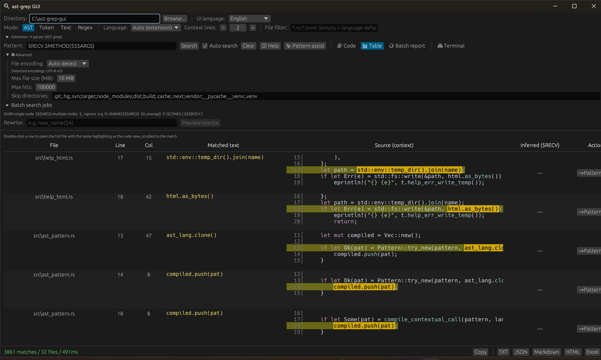

# ast-grep GUI

[日本語版はこちら](./README.jp.md)

A desktop GUI frontend for [ast-grep](https://ast-grep.github.io/) built with Rust and `egui`.
It is designed to make structural code search easier for users who prefer a visual workflow over the CLI.



## Highlights

- AST-based code search powered by `ast-grep-core`
- Batch rewrite (like `--rewrite`): preview, diff, then write back files in `AST` mode
- Search modes for `AST`, `Token`, plain text, and regex
- Auto language detection by file extension for mixed-language repositories
- Code view, table view (with double-click preview popup), **Summary** view (aggregates type-hint variations: receiver type, call arity, and per-argument types—plus a method column when the pattern exposes one), and **batch report** view (run multiple patterns with per-job settings, then review an aggregated report)
- Best-effort type hints in search results for supported languages: one column per single metavariable (`$NAME`), and for multi-node captures (`$$$ARGS`, etc.) a count column (`ARGS#arity`) plus one column per captured node (`ARGS#0`, `ARGS#1`, …). **C++** can follow `#include` into headers on disk; **Advanced settings** (AST-related modes) let you add semicolon-separated **include directories** (compiler `-I` equivalent) so system or SDK headers resolve for hints.
- Pattern help, presets, snippet-based pattern assist, and **pattern input history** (up to 30 entries)
- Optional **incremental search** that automatically reruns after you stop typing for a short delay
- Built-in **regex visualizer** to inspect and test regular expressions interactively
- Plain-text search options for **case-insensitive** and **whole-word** matching
- Export results to `TXT`, `JSON`, `Markdown`, `HTML`, and `Excel (.xlsx)` (including multi-job batch reports after a batch run)
- UI language switching between Japanese and English (auto-detected from OS locale)
- Configurable **max hit count** to cap large result sets (default: 100,000)
- Auto text encoding detection with `chardetng`, plus manual `UTF-8`, `UTF-16 LE`, `UTF-16 BE`, `Shift_JIS`, `EUC-JP`, `JIS`, `GBK`, `Big5`, `EUC-KR`, and `Latin1` family overrides
- Built-in terminal panel for PowerShell commands and `sg run`-style searches

## Supported Languages

- Rust
- Java
- Python
- JavaScript
- TypeScript
- Go
- C
- C++
- C#
- Kotlin
- Scala
- `Auto` mode detects the parser from each file extension

## Requirements

- Rust stable toolchain
- Windows is the primary target environment
- For release builds in this repository, the configured target is `x86_64-pc-windows-msvc`

## Run Locally

```powershell
cargo run
```

For an optimized build:

```powershell
cargo run --release
```

To build the Windows release binary explicitly:

```powershell
cargo build --release --target x86_64-pc-windows-msvc
```

## Usage

1. Select a directory to search.
2. Choose a search mode.
3. In `AST` mode, choose a language or use `Auto`.
4. Enter an AST pattern, token sequence, plain text, or regex.
5. Adjust context lines, file filter, encoding, skip directories, mode-specific options, and (in AST-related modes) **Advanced settings**—including **C++ include directories** for type-hint resolution—as needed.
6. Run the search and inspect the results in code view, table view, or **Summary** view.
7. Export or copy the results if needed.

### AST Pattern Tips

- Use meta variables such as `$VAR`, `$$$ARGS`, and `$_`
- When a pattern includes metavariables that capture code, the app computes type hints (syntax-based, best-effort): single metavariables (`$RECV`, `$VAR`, …) get one column each; multi-node metavariables (`$$$ARGS`, …) get a `NAME#arity` column (number of captured nodes, e.g. call arity) and `NAME#0`, `NAME#1`, … for each captured node’s inferred type. Anonymous `$$$` / `$$$_` are not listed as columns. For **C++**, set **include directories** in Advanced settings if types exist only in headers outside the current file’s directory (e.g. `#include <vector>`).
- Open the built-in help popup for examples and presets
- Use the pattern assist dialog to generate candidate patterns from a code snippet

Example patterns:

```text
fn $NAME($$$ARGS)
$VAR.unwrap()
console.log($$$ARGS)
```

## Search Modes

- `AST`: structural search using ast-grep patterns
- `Token`: searches space-separated tokens in order, allowing flexible whitespace between them
- `Text`: plain substring search with optional case-insensitive and whole-word matching
- `Regex`: regular-expression search

## Export Formats

- `TXT`
- `JSON`
- `Markdown`
- `HTML`
- `Excel (.xlsx)`
- Copy to clipboard

When the pattern includes metavariables used for type hints, `JSON`, `Markdown`, `HTML`, and `Excel` exports include the same hint columns as the table view (including `NAME#arity` and `NAME#i` for `$$$NAME` captures).

## Packaging and Release

- `build.rs` embeds `assets/icon.ico` into Windows builds when available
- `.cargo/config.toml` enables static CRT linking for `x86_64-pc-windows-msvc`
- `.github/workflows/release.yml` builds and publishes `ast-grep-gui.exe` when a `v*` tag is pushed

## Project Structure

```text
src/main.rs              Application entry point
src/app.rs               App state and main UI flow
src/search.rs            Background search engine
src/ast_pattern.rs       Pattern compilation strategies (contextual call support)
src/receiver_hint.rs     Best-effort metavariable type hints (per language; C++ can use extra include paths)
src/lang.rs              Language definitions and presets
src/pattern_assist.rs    Snippet-to-pattern suggestions
src/export.rs            Exporters
src/file_encoding.rs     Text encoding detection and reading
src/i18n.rs              UI language (Japanese / English)
src/regex_visualizer.rs  Regex tokenizer for the visualizer feature
src/help_html.rs         Opens embedded HTML help in the OS browser
src/terminal.rs          Built-in terminal state
src/sg_command.rs        Parses `sg run`-style terminal commands
src/ui/                  GUI panels and popups
assets/help/             Embedded pattern help HTML pages
```

## Notes

- The app currently targets Windows-focused distribution.
- Column offsets for highlighted matches are byte-based, so multibyte text can still have edge cases.
- Search settings, C++ include paths (Advanced), and pattern history are persisted between launches.

## Recent updates (excerpt)

User-facing changes from recent development (see `git log` for the full history):

- **C++ type hints:** optional **include directories** (`-I`-style, semicolon-separated) in Advanced settings so `#include` resolution can reach system or SDK headers.
- **Summary view:** aggregates inferred receiver types, arity, and per-argument types (and a method column when the pattern exposes one).
- **Table view:** resizable type-hint columns, sticky header, keyboard horizontal scroll, and clearer empty vs unknown hint cells.
