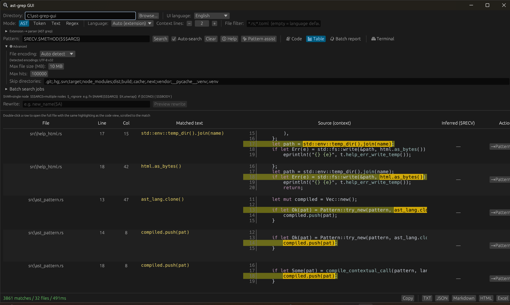

# ast-grep GUI

[日本語版はこちら](./README.jp.md)

A desktop GUI frontend for [ast-grep](https://ast-grep.github.io/) built with Rust and `egui`.
It is designed to make structural code search easier for users who prefer a visual workflow over the CLI.



## Highlights

- **Search targets:** local directory, or **remote Git / SVN URL** (no prior clone/checkout; fetched into a local cache, then searched)
- **Open hits in the default app:** open a matched file with the OS file association from the file list, code view, or table view
- AST-based code search powered by `ast-grep-core`
- Batch rewrite (like `--rewrite`): preview, diff, then write back files in `AST` mode
- Search modes for `AST`, `Token`, plain text, and regex
- Auto language detection by file extension for mixed-language repositories
- Code view, table view (with double-click preview popup), **Summary** view (aggregates type-hint variations: receiver type, call arity, and per-argument types—plus a method column when the pattern exposes one), and **batch report** view (run multiple patterns with per-job settings, then review an aggregated report)
- Best-effort type hints in search results for supported languages: one column per single metavariable (`$NAME`), and for multi-node captures (`$$$ARGS`, etc.) a count column (`ARGS#arity`) plus one column per captured node (`ARGS#0`, `ARGS#1`, …). **C++** can follow `#include` into headers on disk; **Advanced settings** (AST-related modes) let you add semicolon-separated **include directories** (compiler `-I` equivalent) so system or SDK headers resolve for hints.
- Pattern help, presets, snippet-based pattern assist, and **pattern input history** (up to 30 entries)
- Optional **incremental search** that automatically reruns after you stop typing for a short delay
- Built-in **regex visualizer** to inspect and test regular expressions interactively
- Plain-text search options for **case-insensitive** and **whole-word** matching
- Export results to `TXT`, `JSON`, `Markdown`, `HTML`, and `Excel (.xlsx)` (including multi-job batch reports after a batch run)
- UI language switching between Japanese and English (auto-detected from OS locale)
- Configurable **max hit count** to cap large result sets (default: 100,000)
- Auto text encoding detection with `chardetng`, plus manual `UTF-8`, `UTF-16 LE`, `UTF-16 BE`, `Shift_JIS`, `EUC-JP`, `JIS`, `GBK`, `Big5`, `EUC-KR`, and `Latin1` family overrides
- Built-in terminal panel for PowerShell commands and `sg run`-style searches
- **In-document find** (**Ctrl+F**) in the code view, table view, and file preview popup: literal substring search (with optional case sensitivity), previous/next match, scroll sync, and **highlighting** of all hits (the active hit is emphasized)
- **Single-exe `--batch` mode** for large-scale batch search from a one-pattern-per-line file
- **GUI CLI builder** to compose CLI commands, copy them, or run the same settings inside the GUI

## Supported Languages

- Rust
- Java
- Python
- JavaScript
- TypeScript
- Go
- C
- C++
- C#
- Kotlin
- Scala
- `Auto` mode detects the parser from each file extension

## Requirements

- Rust stable toolchain
- Windows is the primary target environment
- For release builds in this repository, the configured target is `x86_64-pc-windows-msvc`

## Run Locally

```powershell
cargo run
```

For an optimized build:

```powershell
cargo run --release
```

To build the Windows release binary explicitly:

```powershell
cargo build --release --target x86_64-pc-windows-msvc
```

Batch mode uses the same executable with `--batch` (no separate binary).

## Command-Line Batch Search

Run many AST patterns without opening the GUI. Provide **one pattern per line** in a text file.

### Pattern file example (`patterns.txt`)

```text
# Comments and blank lines are ignored
fn $NAME($$$ARGS)
$VAR.unwrap()
console.log($$$ARGS)
```

### Basic command

```powershell
cargo run -- --batch `
  --patterns patterns.txt `
  --dir C:\path\to\repo `
  --lang rust `
  --view table `
  --format json `
  --output result.json
```

### Output views

| View | Description |
|------|-------------|
| `code` | Code-view style (per file, with surrounding context) |
| `table` | Table view (full rows with type-hint columns) |
| `summary` | Summary (type-hint variation aggregation) |

Combine views with `--view code,summary`. For Excel (`xlsx`), **one workbook** contains separate sheets per view.

```powershell
cargo run -- --batch `
  --patterns patterns.txt `
  --dir C:\path\to\repo `
  --lang cpp `
  --view code,summary `
  --format xlsx `
  --output report.xlsx
```

### Main options

| Option | Description |
|--------|-------------|
| `--patterns` | One-pattern-per-line input file |
| `--dir` | Local search root directory |
| `--git-url` | Git remote URL to fetch before search (alternative to `--dir`) |
| `--svn-url` | SVN remote URL to fetch before search (alternative to `--dir`) |
| `--ref` | Git branch / tag / commit (with `--git-url`) |
| `--revision` | SVN revision (with `--svn-url`; empty = HEAD) |
| `--subdir` | Subdirectory within the fetched tree |
| `--refresh-cache` | Re-fetch remote content on the next run |
| `--lang` | Language (`auto`, `rust`, `cpp`, …) |
| `--view` | `code` / `table` / `summary` (comma-separated) |
| `--format` | `text` / `json` / `markdown` / `html` / `xlsx` |
| `--output` | Output path (required in batch mode) |
| `--context` | Context lines (default: 2) |
| `--filter` | File name filter (`;`-separated globs) |
| `--skip-dirs` | Directory names to skip (`;`-separated) |
| `--max-hits` | Max hits per pattern (0 = unlimited) |
| `--include-dirs` | C++ include paths for type hints |
| `--no-type-hints` | Disable type-hint inference |

### Remote Git / SVN (batch)

```powershell
cargo run -- --batch `
  --patterns patterns.txt `
  --git-url https://github.com/example/repo.git `
  --ref main `
  --subdir src `
  --lang rust `
  --view table `
  --format json `
  --output result.json
```

```powershell
cargo run -- --batch `
  --patterns patterns.txt `
  --svn-url https://svn.example.com/repo/trunk `
  --revision 12345 `
  --lang auto `
  --view table `
  --format json `
  --output result.json
```

Remote fetch uses embedded Rust libraries (`gix` for Git, `svn` + WebDAV for SVN)—not the `git` or `svn` CLI. Fetched trees are cached under `%LOCALAPPDATA%\ast-grep-gui\vcs-cache` (Windows).

## GUI CLI Builder

Open **⌨ CLI builder** in the toolbar **Batch jobs** section to compose the same CLI from the GUI.

1. Choose a **pattern file** and optional **output file** (required for `xlsx`)
2. Select **output views** (code / table / summary) and **format**
3. Review the **command preview**, then **Copy** or **Run with these settings**
4. Runs execute as in-GUI batch search; review results in **Batch report**
5. If an output file was set, export runs automatically when the batch finishes

Search directory, language, and advanced settings come from the main toolbar.

Search directory, language, and advanced settings come from the main toolbar. When **Git URL** or **SVN URL** is selected as the search target, the remote URL, ref/revision, and subdirectory fields are included in the CLI preview.

## Usage

1. Choose a **search target**: **Local**, **Git URL**, or **SVN URL**.
2. For **Local**, pick a directory. For **Git/SVN**, enter the remote URL and optionally a ref/revision and subdirectory; use **Refresh** to force a re-fetch on the next search.
3. Choose a search mode.
4. In `AST` mode, choose a language or use `Auto`.
5. Enter an AST pattern, token sequence, plain text, or regex.
6. Adjust context lines, file filter, encoding, skip directories, mode-specific options, and (in AST-related modes) **Advanced settings**—including **C++ include directories** for type-hint resolution—as needed.
7. Run the search and inspect the results in code view, table view, or **Summary** view.
8. Use **Open** on a hit to launch the file with the OS default application, or export/copy results as needed.

### Remote Git / SVN search

- **Git URL** supports HTTPS, SSH (`git@…`), `git://`, and `file://` via `gix` (no `git` executable required).
- **SVN URL** supports `svn://` and HTTP(S) via Rust libraries (no `svn` executable required).
- Only the **tracked tree** at the requested ref/revision is searched (no untracked files).
- The resolved cache path is shown in the toolbar after a successful fetch.
- **Note:** `svn+ssh://` is not enabled in the current dependency set (Rust toolchain / crate compatibility).

### In-document find (Ctrl+F)

With the code panel, table view, or file preview focused, press **Ctrl+F** to open the find bar. Type a substring, optionally toggle **case sensitivity**, and use **↑ / ↓** (or the equivalent buttons) to jump between matches. Matches are **highlighted** in the source (code view and preview); the table view scrolls to each matching row.

### AST Pattern Tips

- Use meta variables such as `$VAR`, `$$$ARGS`, and `$_`
- When a pattern includes metavariables that capture code, the app computes type hints (syntax-based, best-effort): single metavariables (`$RECV`, `$VAR`, …) get one column each; multi-node metavariables (`$$$ARGS`, …) get a `NAME#arity` column (number of captured nodes, e.g. call arity) and `NAME#0`, `NAME#1`, … for each captured node’s inferred type. Anonymous `$$$` / `$$$_` are not listed as columns. For **C++**, set **include directories** in Advanced settings if types exist only in headers outside the current file’s directory (e.g. `#include <vector>`).
- Open the built-in help popup for examples and presets
- Use the pattern assist dialog to generate candidate patterns from a code snippet

Example patterns:

```text
fn $NAME($$$ARGS)
$VAR.unwrap()
console.log($$$ARGS)
```

## Search Modes

- `AST`: structural search using ast-grep patterns
- `Token`: searches space-separated tokens in order, allowing flexible whitespace between them
- `Text`: plain substring search with optional case-insensitive and whole-word matching
- `Regex`: regular-expression search

## Export Formats

- `TXT`
- `JSON`
- `Markdown`
- `HTML`
- `Excel (.xlsx)`
- Copy to clipboard

When the pattern includes metavariables used for type hints, `JSON`, `Markdown`, `HTML`, and `Excel` exports include the same hint columns as the table view (including `NAME#arity` and `NAME#i` for `$$$NAME` captures).

## Packaging and Release

- `build.rs` embeds `assets/icon.ico` into Windows builds when available
- `.cargo/config.toml` enables static CRT linking for `x86_64-pc-windows-msvc`
- `.github/workflows/release.yml` builds and publishes `ast-grep-gui.exe` when a `v*` tag is pushed

## Project Structure

```text
src/lib.rs               Shared library for GUI and CLI
src/main.rs              GUI entry point
src/cli_runner.rs          `--batch` CLI batch runner
src/cli_config.rs        Shared CLI / GUI builder settings
src/app.rs               App state and main UI flow
src/search.rs            Background search engine
src/search_target.rs     Search target types (local / Git / SVN remote)
src/remote_fetch.rs      Remote fetch orchestration (async + sync for CLI)
src/vcs_cache.rs         Remote fetch cache paths and markers
src/git_remote.rs        Git clone via gix (no git CLI)
src/svn_remote.rs        SVN export via svn crate / WebDAV (no svn CLI)
src/ast_pattern.rs       Pattern compilation strategies (contextual call support)
src/receiver_hint.rs     Best-effort metavariable type hints (per language; C++ can use extra include paths)
src/lang.rs              Language definitions and presets
src/pattern_assist.rs    Snippet-to-pattern suggestions
src/export.rs            Exporters
src/file_encoding.rs     Text encoding detection and reading
src/i18n.rs              UI language (Japanese / English)
src/regex_visualizer.rs  Regex tokenizer for the visualizer feature
src/help_html.rs         Opens embedded HTML help in the OS browser
src/terminal.rs          Built-in terminal state
src/sg_command.rs        Parses `sg run`-style terminal commands
src/ui/cli_builder_panel.rs  CLI builder popup
src/ui/                  GUI panels and popups
assets/help/             Embedded pattern help HTML pages
```

## Notes

- The app currently targets Windows-focused distribution.
- Column offsets for highlighted matches are byte-based, so multibyte text can still have edge cases.
- Search settings, remote URL/ref/subdir, C++ include paths (Advanced), and pattern history are persisted between launches.
- Remote fetch cache lives under `%LOCALAPPDATA%\ast-grep-gui\vcs-cache` on Windows.

## Recent updates (excerpt)

User-facing changes from recent development (see `git log` for the full history):

- **Remote Git/SVN search:** search by remote URL without a local clone/checkout; optional ref/revision and subdirectory; local cache with refresh.
- **Open in default app:** open matched files from the file list, code header, or table action column.
- **C++ type hints:** optional **include directories** (`-I`-style, semicolon-separated) in Advanced settings so `#include` resolution can reach system or SDK headers.
- **Summary view:** aggregates inferred receiver types, arity, and per-argument types (and a method column when the pattern exposes one).
- **Table view:** resizable type-hint columns, sticky header, keyboard horizontal scroll, and clearer empty vs unknown hint cells.
- **In-document find (Ctrl+F):** search within the current code, table, or preview; hit highlighting and navigation between matches.
